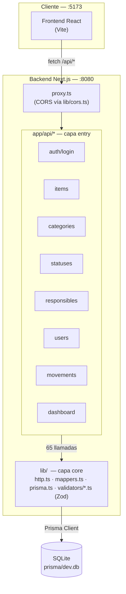

# Arquitectura

Diagrama de capas real del backend y su conexión con el frontend, extraído
del grafo de dependencias del proyecto (`get_architecture` sobre 565 nodos
y 1146 aristas indexadas).

## Capas

- **`app/api/*`** — capa de entrada. Cada `route.ts` exporta los métodos
  HTTP (`GET`/`POST`/`PUT`/`DELETE`) y solo llama hacia `lib/`, nunca al
  revés (0 aristas entrantes en el grafo).
- **`lib/`** — núcleo compartido, el punto de mayor fan-in del proyecto
  (66 llamadas entrantes, 0 salientes). `http.ts` centraliza las
  respuestas (`jsonOk`, `notFound`, `fromZodError`, `jsonCreated`,
  `jsonNoContent`); `validators/*.ts` valida cada DTO con Zod antes de
  tocar la base; `mappers.ts` aplana las relaciones de Prisma al shape
  exacto que espera el frontend.
- **`proxy.ts`** — reemplaza el `middleware.ts` de versiones anteriores de
  Next.js (ver el ADR correspondiente en [`decisiones/`](decisiones/)),
  aplica CORS antes de que la request llegue a `app/api/*`.

No hay capa de servicios entre las rutas y Prisma — para el tamaño de este
CRUD, meter una capa extra de servicios habría sido complejidad sin
beneficio real.
